# 2025- QUESOS BARTOLOME
Quesos Bartolomé is a website that manages the sales of cheeses from a small-town dairy in Aldeonte, a village in Segovia.
The platform provides customers with a more convenient way to place their orders, while also allowing them to read reviews from other buyers and share their own feedback on the products they purchase.
In addition, the application gives administrators tools to track cheese sales through graphs and automates the process of confirming orders and generating invoices for customers.

It is important to note that, to date, only the functional objectives and technical objectives of the Quesos Bartolomé application have been clearly defined. Development has begun, but the implementation is not functional yet.
## Objectives
### Functional Objectives
The main functional objectives of the application are: for registered users, placing orders and leaving reviews for the products they purchase; and for administrators, managing orders, controlling products, generating invoices, and analyzing sales through different charts.

- **Placing orders:** Registered users can add different products to their order and then send it to the dairy.

- **Product reviews:** Registered users can leave reviews for the products they have purchased.

- **Profile management:** Registered users can update their profile whenever they wish.

- **Stock management:** Administrators can add new cheeses to the catalog as well as update stock levels for each cheese.

- **Order management:** Administrators can view and process orders placed with the dairy.

- **Sales charts:** Administrators can access charts that display different sales metrics by month, both by customer and by cheese type.

- **User management:** Administrators can ban users who have engaged in inappropriate behavior.

### Technical Objectives
The more technical aspects of the application focus on thorough code control through automated unit and integration tests, covering business logic, database services, and verifying the behavior of components and services of a REST API. In addition, static code analysis will be performed to report violations and warnings, with continuous monitoring throughout the development of the application.
We will also integrate complementary technologies to enhance the user experience in our application and services, such as invoice generation, email sending, and the use of maps to locate elements.

- **Automated unit and integration tests:** Tests that run automatically to ensure good code quality by checking the business logic and the different services and components of the application.

- **Static code analysis:** Static code analysis with SonarQube to continuously improve the quality, security, and maintainability of the code throughout the project.

- **Email sending:** Sending emails to customers with important messages or invoices issued by the company.

- **PDF generation:** Generating invoices from customer orders.

- **Use of maps:** Using Google Maps to display the location of the dairy in the "About Us" section.

## Methodology
The project will be carried out in phases, each with a defined start and end date. Every phase includes a set of tasks aimed at completing the final degree project in an organized and effective way.

### Phase 1: Definition of functionalities and screens.
- Start date: September 10, 2025
- End date: September 16, 2025
- In this phase, the general aspects of the application will be defined, along with its functionalities, which will be divided into basic, intermediate, and advanced. The roles of the different users will also be established. Additionally, the designs of the application’s screens will be created.
### Phase 2: Repository, testing, and CI.
- Start date:
- End date:
- The Git repository will be created, a minimum set of automated tests will be implemented, and the CI system will be configured.
### Phase 3: Version 0.1 - Basic functionality and Docker.
- Start date:
- End date:
- Development of the application will begin by implementing the basic functionality and its automated tests. The application will also be packaged in Docker. At the end of this phase, the first release (version 0.1) of the application will be delivered.
### Phase 4: Version 0.2 - Intermediate functionality.
- Start date:
- End date:
- Development will continue with the implementation of intermediate functionalities, resulting in version 0.2 of the application.
### Phase 5: Version 1.0 - Advanced functionality.
- Start date:
- End date:
- The application development will be completed with the implementation of advanced functionalities, resulting in the final release (version 1.0) of the application.
### Phase 6: Report.
- Start date:
- End date:
- The final degree project report will be written.
### Phase 7: Defense.
- Start date:
- End date:
- The defense of the final degree project will take place.
### Gantt Chart

## Detailed Features
Below, we present all the functionalities of the application, divided into basic, intermediate, and advanced, specifying which type of user they are intended for.

### Basic Functionality.
| Users | Functionalities |
|----------|-----------------|
| Unregistered users | -View cheeses, their characteristics, and reviews   -See the "Acerca de nosotros" section   -View profiles of review authors   -Register   -Log in |
| Registered users | -Place orders   -Access their profile |
| Administrators | -Add and remove cheeses   -View orders   -View customers   -Manage stock |

### Intermediate Functionality.
| Users | Functionalities |
|----------|-----------------|
| Registered users | -Edit their profile   -Change their credentials   -View, edit, and delete their reviews |
| Administrators | -Ban users   -View charts   -Edit cheeses in the catalog |
### Advanced Functionality.
| Users | Functionalities |
|----------|-----------------|
| Administrators | -Process orders   -Generate invoices   -Send emails to users   -Filter charts by cheeses and customers |

## Analysis
### Screens and Navigation.
Below, we present the screens of our application in the form of wireframes, along with a brief description.

#### Main Screen

This screen displays the cheeses available in the dairy. Depending on the type of user accessing it, different options will appear in the menu.
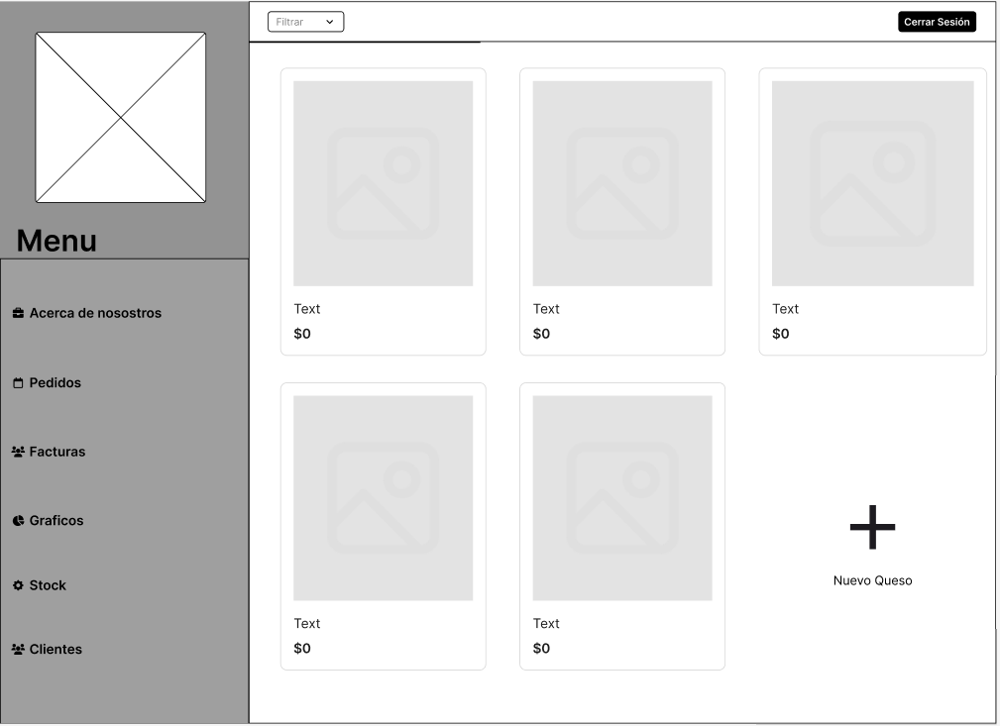

#### Register

Form for entering the data required to register a new customer.

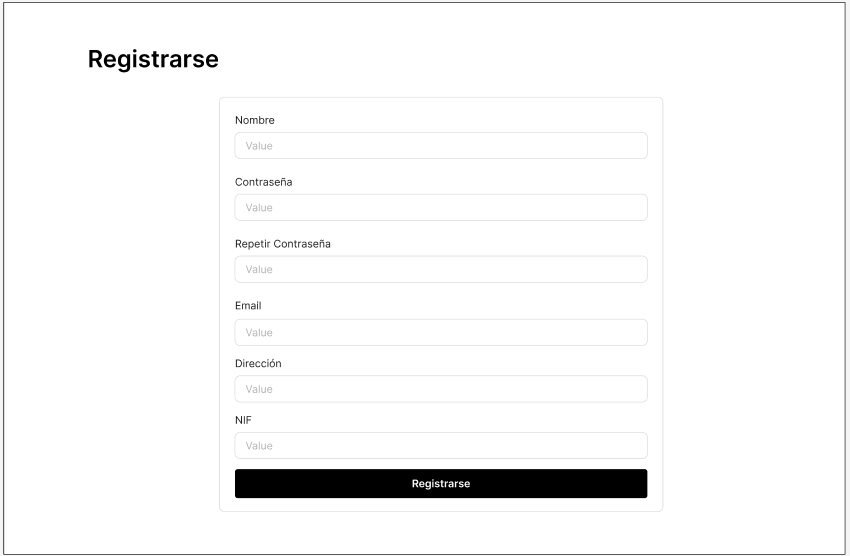

#### Log In

Form to log in.

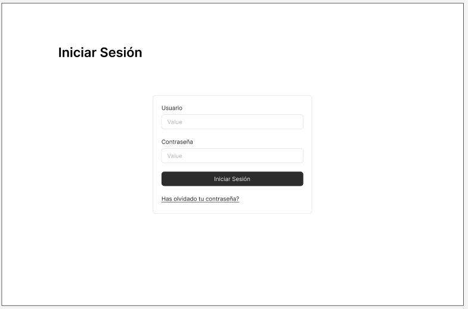

#### About Us

Section with some information about the dairy, including a map showing its location and a QR code linking to a page of interest.

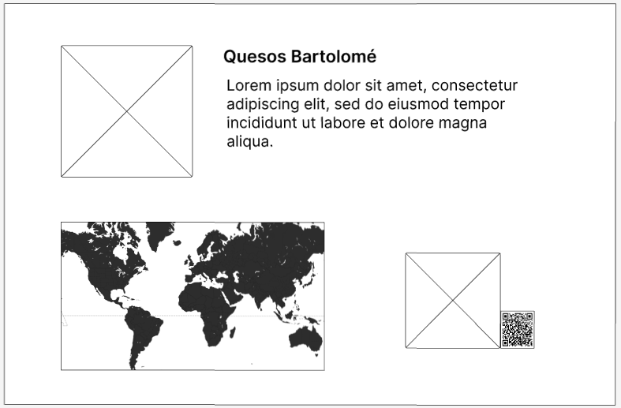

#### Product

Page displaying detailed information about a cheese, its price, and—if you are a registered user—an option to add it to your order.

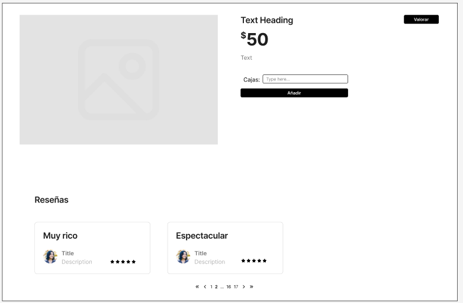

#### My Order

Section showing all the cheeses you have added to your order, from where you can send it to the company for processing.

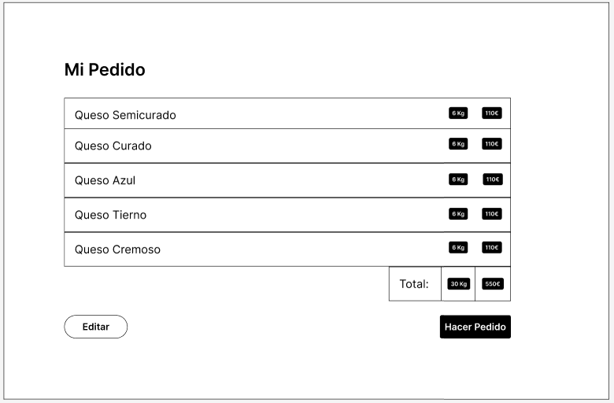

#### Review

Small screen with a brief form for reviewing a cheese.

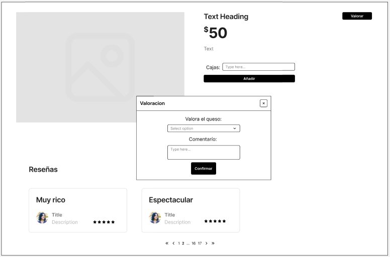

#### View Orders

Section where administrators can see all pending orders in the queue and decide whether to process them.

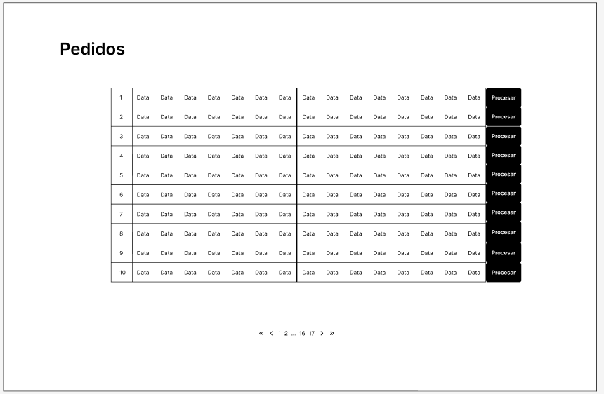

#### Process Order

Page showing a summary of the order and allowing it to be processed.

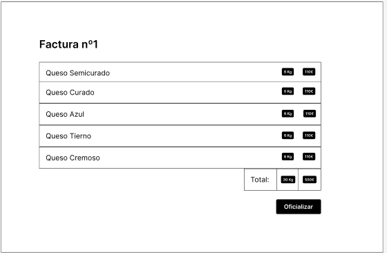

#### View Customers

Section displaying a table with all of the dairy’s customers, allowing administrators to access their profiles and ban them if necessary.

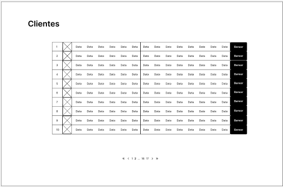

#### Invoices

Section where invoices issued by the dairy can be viewed.

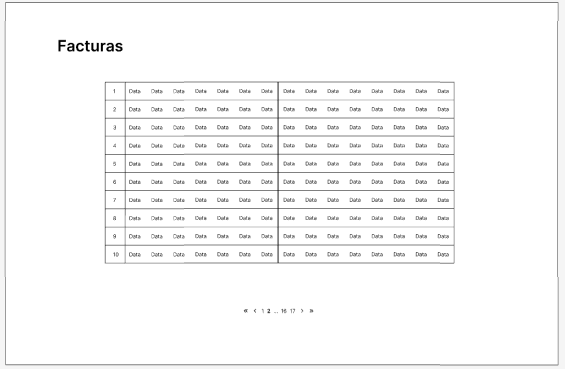

#### New Cheese

Form that allows the administrator to add a new cheese to the catalog.

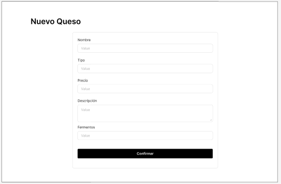

#### Stock

Section where the administrator manages the stock of existing cheeses in the catalog.

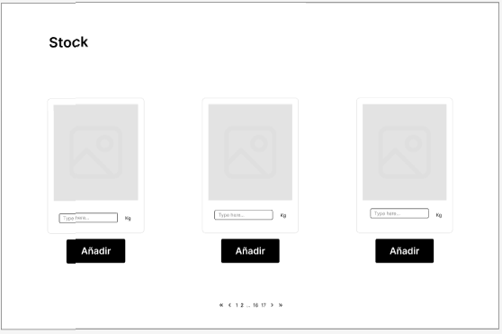

#### Charts

Page where administrators can view and analyze charts of cheese sales.

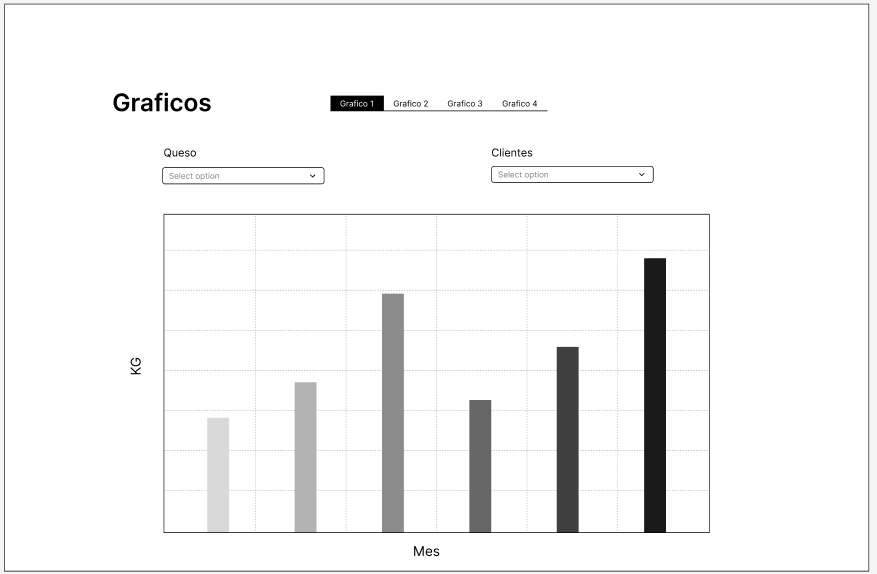

#### Error

Example of an application error and how the system notifies the user, regardless of the type of error.

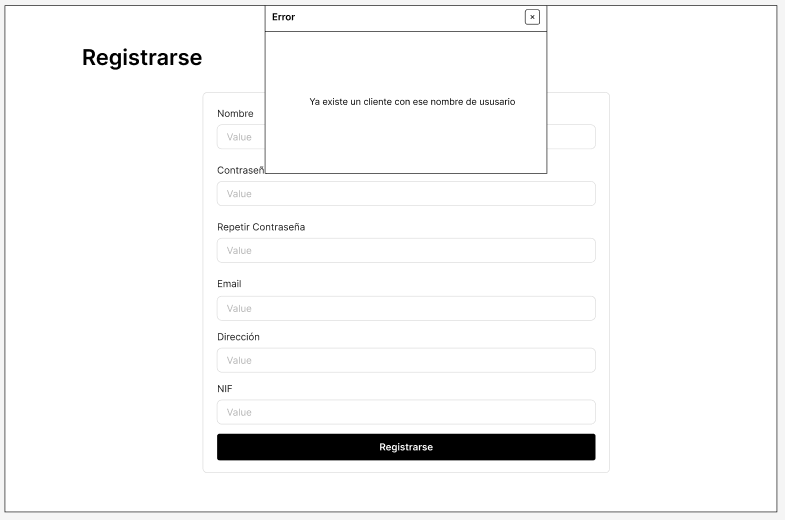

#### Navigation

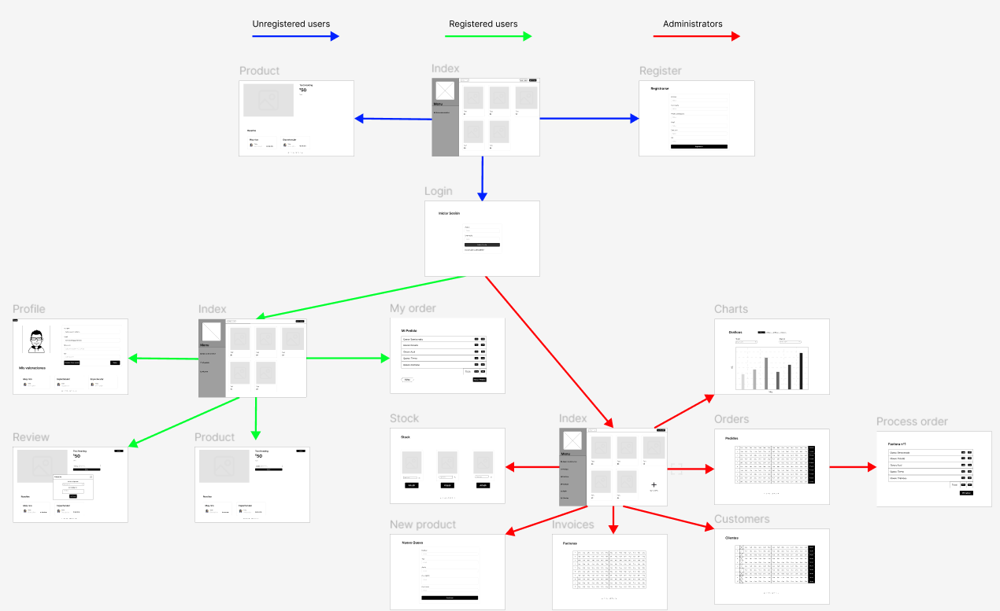

### Entities  
| Entity | Attributes | Relationships |
|---------|-----------|------------|
| User | -Id   -Name   -Password   -Email   -Address   -Type   -Tax ID   -Image | -Users are related to reviews   -Users are related to orders   -Users are related to invoices |
| Cheese | -Id   -Name   -Price   -Description   -Manufacturing date   -Expiration date   -Type   -Image   -Review list | -Cheeses are related to orders   -Cheeses are related to reviews |
| Orders | -Id   -Customer   -Cheese list | -Orders are related to users   -Orders are related to cheeses   -Orders are related to invoices |
| Invoices | -Id   -Invoice No.   -Customer   -Cheese list   -Kg   -Total price | -Invoices are related to users   -Invoices are related to orders |
| Review | -Id   -User   -Cheese   -Rating   -Comment | -Reviews are related to users   -Reviews are related to cheeses |

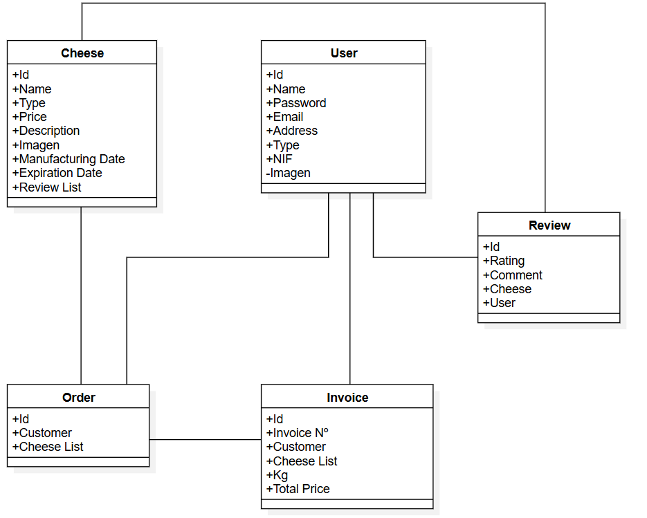

### User Permissions  

Registered users are the owners of their own reviews for each cheese; they can create, view, edit, and delete them whenever they wish.  
Users are also the owners of their active order until it is confirmed; they can edit and view it whenever they want.  
Administrators, on the other hand, can create, view, edit, and delete cheeses in the catalog.  
Administrators can convert orders into invoices and view them.  
Administrators can also ban users.  

### Images  

The Cheese and User entities will have an associated image.  

### Charts  

The charts will be bar charts, visible only to administrators. On the x-axis, the months of the year will be displayed, and on the y-axis, either the € sold each month or the Kg sold each month.  
Additionally, they can be filtered by customer (to see what each customer buys per month) and by cheese (to see how much of each cheese is sold), in order to analyze the dairy’s sales.  

### Complementary Technology  

- **Email sending:** Sending emails to customers with important messages or invoices issued by the company.  
- **PDF generation:** Generating invoices from customer orders.  
- **Use of maps:** Using Google Maps to display the dairy’s location in the "About Us" section.  

### Advanced Algorithm or Query  

On the main page, the cheeses with the highest average rating will be displayed first, with this rating calculated from customer reviews.  

## Tracking  

- [GitHub Project](https://github.com/orgs/codeurjc-students/projects/27)  

## Author  

The development of this application is carried out as part of the final degree project for the Software Engineering degree at the ETSII of Universidad Rey Juan Carlos in Madrid.  
Work completed by fourth-year student Víctor Bartolomé Letosa, supervised by Michel Maes Bermejo.  

## Guía de desarrollo

### Índice
[Functional Objectives](#author)
[Functional Objectives](#author)
[Functional Objectives](#author)
[Functional Objectives](#author)
[Functional Objectives](#author)

### Introducción

La aplicacción Quesos Bartolomé se ha desarrollado siguiendo una arquitectura web de tipo SPA (Single Page Application). Lo que separa esta aplicación en tres parte el Cliente (frontend), el servidor (backend) y la base de datos para almacenar la infomración de la aplicación, este tipo de web mejora el rendimiento de la web y mejora la experiencia de usuario al permitir la interacción asíncrona y la actualización de contenido sin necesidad de recargar la página.
Partes detalladas:

| Parte del Sistema | Explicación |
|---------|-----------|
| Frontend | - Utilizando Angular, es responsable de la interfaz gráfica y de la interacción con el usuario, hace peticiones y consume la API REST de backend |
| Backend | - Implementado con Spring Boot, gestiona la lógica de negocio, el control de acceso, la validación de datos y la comunicación con la base de datos. |
| Base de Datos | - Base de datos MySQL que guarda los datos de la aplicación |

### Resumen Tecnico

| Categoria | Descripción |
|---------|-----------|
| Tipo | - Web SPA + API REST (arquitectura cliente-servidor desacoplada). |
| Frontend | - Angular, desarrollado en TypeScript, compilado a JavaScript. |
| Backend | - Spring Boot (Java 21). Gestiona la lógica de negocio, la autenticación y la API REST. Maven se utiliza para la gestión de dependencias y construcción del proyecto. |
| Base de Datos | - Base de datos MySQL donde se almacenan entidades del sistema.(Quesos, Pedidos, Usuarios...) |
| Herramientas de desarrollo | - Virtual Studio Code para frontend y backend. Uso de npm para la gestión de paquetes del frontend y Maven para el backend. Docker se usa para contenedores en despliegue, y Postman para probar la API REST. |
| Control de calidad | - Tests unitarios, integración y sistema. JUnit, RestAssured, Karma/Jasmine, Selenium. SonarQube para análisis estático y GitHub Actions para CI/CD automatizado. |
| Despliegue | - Docker |
| Proceso | - Desarrollo iterativo e incremental, con control de versiones mediante Git Flow simplificado (ramas feature/ y main). Integración continua configurada en GitHub Actions. |

### Tecnologías

| Tecnologías | Descripción | Link |
|---------|-----------|----------|
| Angular | - Framework de desarrollo web de tipo SPA (Single Page Application) mantenido por Google. | - https://angular.io |
| Spring Boot | - Framework para el desarrollo de aplicaciones Java que simplifica la creación de servicios web y APIs REST. | - https://spring.io/projects/spring-boot |
| TypeScript | - Lenguaje de programación que extiende JavaScript con tipado estático y características orientadas a objetos. | - https://www.typescriptlang.org |
| Java 21 | -Lenguaje de programación empleado en el backend. | - https://www.oracle.com/java/ |
| MySQL | - Sistema de gestión de bases de datos relacional usado para almacenar la información persistente de la aplicación (usuarios, productos, pedidos…). | - https://www.mysql.com |
| MapStruct | - Biblioteca Java que automatiza el mapeo entre entidades y DTOs. | - https://mapstruct.org |
| Karma + Jasmine | - Conjunto de herramientas de testing del frontend. Jasmine define la sintaxis de los tests unitarios y de integración, mientras que Karma actúa como ejecutor (test runner) en entornos reales de navegador (como Chrome Headless). | - https://karma-runner.github.io   - https://jasmine.github.io |
| Rest Assured | - Librería Java para pruebas automatizadas de APIs REST. | - https://rest-assured.io |
| Selenium | - Framework de automatización de pruebas E2E (end-to-end) para aplicaciones web. | - https://www.selenium.dev |

### Herramientas

| Herramientas | Descripción | Link |
|---------|-----------|----------|
| Visual Studio Code | - Entorno de desarrollo ligero y multiplataforma. | - https://code.visualstudio.com |
| Maven | - Herramienta de gestión y automatización de proyectos Java. | - https://maven.apache.org |
| npm (Node Package Manager) | - Permite instalar y administrar las dependencias del proyecto Angular. | - https://www.npmjs.com |
| Postman | -Herramienta gráfica para el diseño, prueba de APIs REST. | - https://www.postman.com |
| Git y GitHub | - Sistema de control de versiones distribuido (Git) y plataforma de colaboración (GitHub) empleados para el desarrollo coordinado del proyecto. | - https://git-scm.com   - https://github.com |
| GitHub Actions | - Servicio de integración y entrega continua (CI/CD) integrado en GitHub. | - https://github.com/features/actions |
| SonarQube | - Plataforma de análisis estático del código fuente. | - [https://www.SonarQube.com](https://www.sonarsource.com/products/sonarqube/) |
| Docker | - Plataforma de virtualización basada en contenedores. Permite empaquetar el frontend, backend y base de datos. | - https://www.docker.com |
