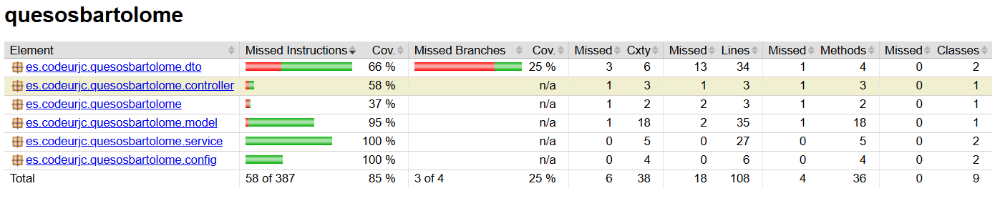
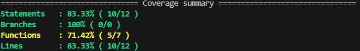
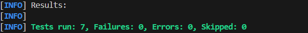
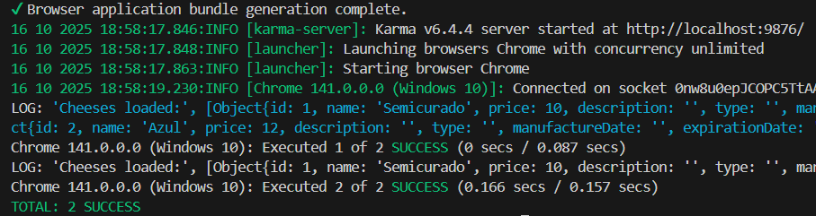
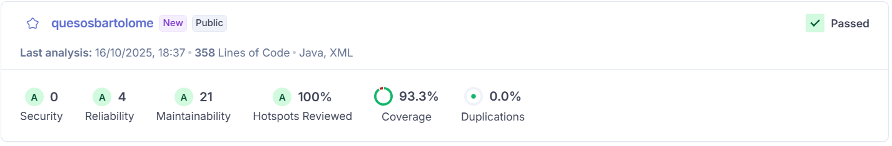
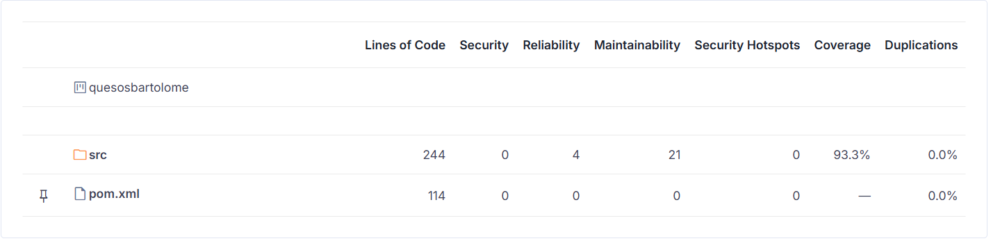

### Quality Control
To ensure the quality and reliability of the Quesos Bartolomé application, a series of automated tests have been conducted for both the client and the server. The tests include system (E2E), unit, and integration tests.
All tests are executed automatically through GitHub Actions workflows, depending on the type of quality control: CI-Feature (unit tests only) and CI-Full (all tests and static code analysis).

#### System Tests (E2E)

- Service Tests: Validates the correct functioning of the REST API developed with Spring Boot. These tests are implemented using the Rest Assured Java library.
- Client Tests: Implemented with Selenium WebDriver to verify the behavior of the Angular user interface.

#### Unit Tests

- Service Tests: Unit tests for backend services are implemented with JUnit 5. A database mock or double is used to avoid testing with real data.
- Client Tests: Unit tests are implemented using Jasmine/Karma along with Angular’s built-in testing framework to verify the functionality of each component.

#### Integration Tests

- Service Tests: Integration tests are executed against the real database to validate that the service integrates correctly.
- Client Tests: Ensures that the service fetches data from the real API and passes it correctly to the presentation component.

#### Coverage
- Backend Coverage:
  

- Frontend Coverage:
  

#### Test Results

- Service: 7 tests executed:
  

- Client: 2 tests executed:
  

#### Static Code Analysis 

